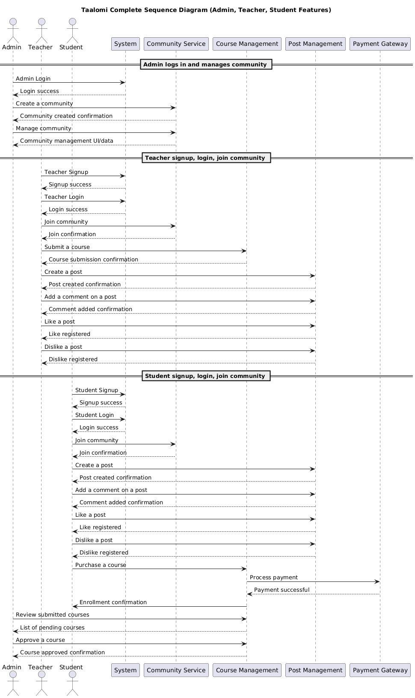

# 3 - Design Phase
# 3.1 - Actors

Based on the defined requirements and functionality, the following actors are extracted :

- **Admin**: Manages the overall platform, including:
  - Creating official communities
  - Assigning or removing moderators
  - Banning or warning users globally

- **Moderator**: Oversees moderation within a specific community, including:
  - Banning or warning users
  - Deleting posts or comments
  - Reviewing reports and requests

- **User**: Regular user who can:
  - Create posts and comments
  - Upvote or downvote content
  - Request new communities

- **System**: Performs automated or background actions such as:
  - Enforcing auto-bans after multiple warnings
  - Updating vote counts
  - Sending notifications or alerts
  - Managing timed or scheduled tasks

# 3.2 - Method and development tools (UML)

Since the Solution relies on multiple services and hence it is designed to address multiple needs the best method that we saw fit is  **RUP (Rational Unified Process)**[2] due to it being needs driven approach and requiring structure yet flexibility. the following **UML diagrams** were later extracted from the functional requirements to visualize the needs and collaborate easier as a team

# 3.3 - Basic Operation

**CRUD** are the core of every action an actor performs, every action can be deconstructed to one or multiple of :

+ **Create**: creation of user account, community, thread, comment and messages all by user of the three role : admin, moderator and regular
+ **Read**: read of user profile, community info, post info, comment, messages and vote status
+ **Update**: update of account settings, posts, community inf, comments and vote status performed as **Edits**
+ **Delete**: deletion of the created elements by the creating actors or higher level actors based on privileges (Admin can Delete moderator and moderator can delete regular user)
# 3.4 - Use-Case Diagram [3]

The core diagram and most important on the **RUP**  method since it relies on iteration, the diagram defines the functionality of each actor and which relations it has with other actors, and defines the **dependencies** between each action

# 3.5 - Sequence Diagram[4]

Represents the sequence of messages between objects during an interaction. A sequence diagram includes a group of objects, represented by lifelines, and the messages that these objects exchange during the interaction for each service

# 3.6 - Class Diagram [5]

Primarily used to visualize a system structure. Besides that, it also shows the main components, their relationships with each other, and their respective attributes

# 3.7 - Relational Model

As chosen design we used SQL databases which are **relational** type of databases as opposed to NoSQL databases, the transformation from class diagram to the relational model follows 3 rules :

+ For each non-abstract class, create a relation with the same schema. The primary key of the relation is one of the class keys.
+ For each single-valued, elementary attribute of a class, create a corresponding attribute in the relation.
+ For each composite attribute with N sub-attributes in a class, create N corresponding attributes in the relation.

# Conclusion

After the design and applying the analysis the resulting diagrams enable us to  move into the next phase where we discuss :
+ Technical Requirements
+ Programming languages and Software choices (CMS, FOSS ...) 
+ The reasons behind our choices
+ The Involved interfaces