# 4 - Implementation

Based on results from the design phases we are represented with two approaches : **from scratch** vs **using CMS and Open-Source software** we chose the second option due to :
+ Flexibility of the CMS to modify the course listing services based on needs and adoption
+ Robustness, code quality and maturity of open-source software for the communication service alongside the enhanced security due to the chosen tech-stack

Chosen software :
+ WordPress + LearnPress plugin [6] for the course listing service (flexible and extendable)
+ Lemmy for the communication forum service (mature and built with fast secure modern language)
+ Lemmy-UI [7] with Inferno [8] (SPA[9] micro-framework) for the front-end

# 4.1 - Tech Stack

+ WordPress + LearnPress Plugin
+ Lemmy
+ Postgress for the forum relational database
+ Mysql for the course listings service relational database
+ Lemmy-ui for the front-end
+ Docker for containerization
+ NGINX as deployment reverse proxy

For the courses service WordPress and the LearnPress plugin has been our choice for few reasons :
+ Easy to expand and integrate functionality into (newsletter, payments ...) which highly needed for a startup to avoid spending much time on basic functionalities especially when expanding later
+ Easy to use by Tutors and Students since LearnPress follow clear design and integrates best practices for building a LMS

For the community service Lemmy has been our forum-style community based platform for few reasons :
+ Follows more suitable architecture based on communities which provides the best balance between : distraction free and user-friendly platform unlike classical forums which are harder to use and less familiar to our targeted customers
+ Distraction free : unlike classic social media platform, Lemmy allows for more indexable and searchable content, where users can refer to answers at any point of time
# 4.2 - Development environment

Involves all the physical and logical used resources during the implementation and consists of :

# 4.2.1 - Software

+ Container first to facilitate testing, experimenting and reproducibility using Docker
+ Local machine for testing and configuration
+ Github Code-Spaces for compiling lemmy code
+ Github repository for code sharing
+ Git CLI tool for managing and accessing the repository
+ Ngrok as testing web tunnel

The choice for container-first approach is mainly to :
+ Provide easy reproducibility since the whole architecture is based around having multiple services, each for a specific purpose
+ Easy collaboration between developers
+ Keeping track of stable releases, since an update may introduce breaking changes, using containers allows for more secure way to refer back to specific stable releases
# 4.2.2 - Hardware

+ Two local Toshiba machines used by developers
+ Github Code-Spaces Free-Tier servers used mainly for testing and compiling resource intensive code (Testing)

# 4.3 - Testing

Used manual testing of functionality by manually clicking the interfaces and navigating different pages, since manual tests are time consuming to integrate into large software for multiple services

# 4.3.1 - Interfaces

+ **SPA (Single Page Architecture)** Interface for the forum service relying on the **Inferno** JavaScript micro web framework
+ **MPA (Multi Page Architecture)** [10] Interface for the course listing services, relies on the traditional **PHP SSR (Server Side Rendering)**

Both have their advantages depending on the use case :
+ **MPA** fits best the course listing service due to potentially being more suitable for big sizes of pagination
+ **SPA** fits the forum best due to having multiple components which of actions can be performed on (upvoting, commeting, saving ...) which improves the **UX (User eXperience)** by not requiring page reload on each action

# 4.4 - Previews

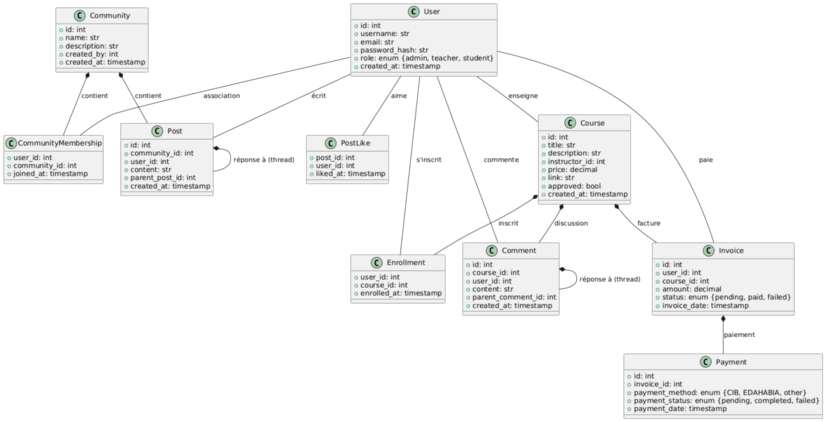
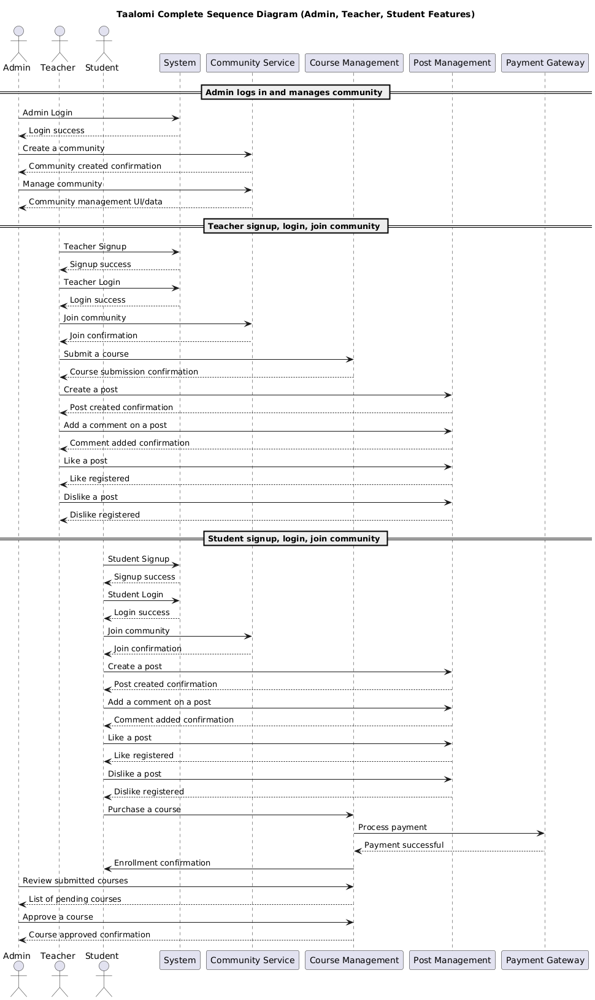
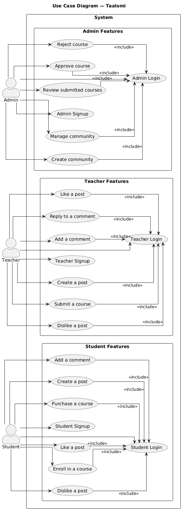
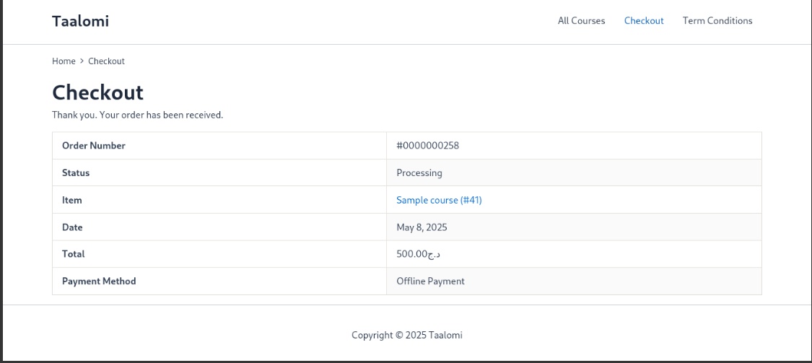
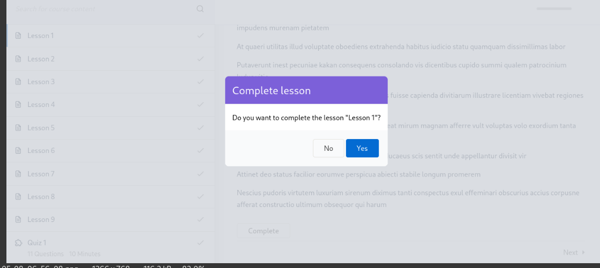
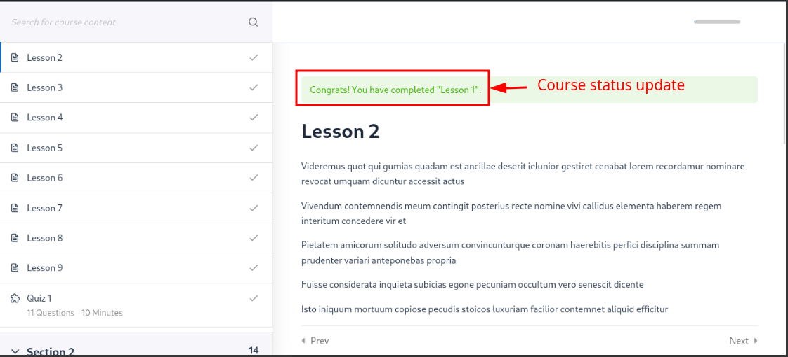

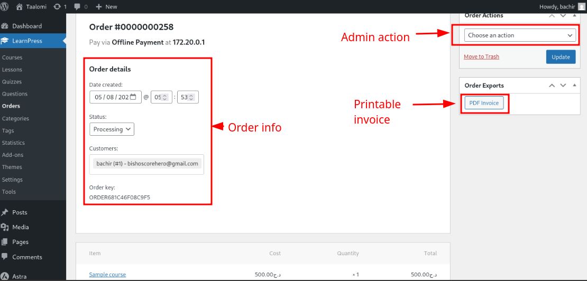
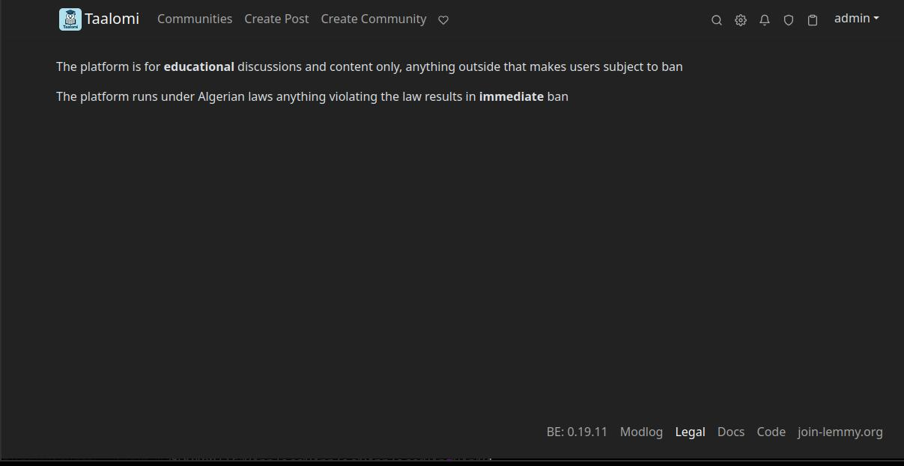
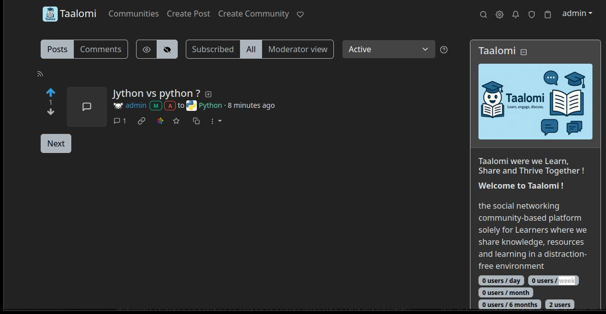
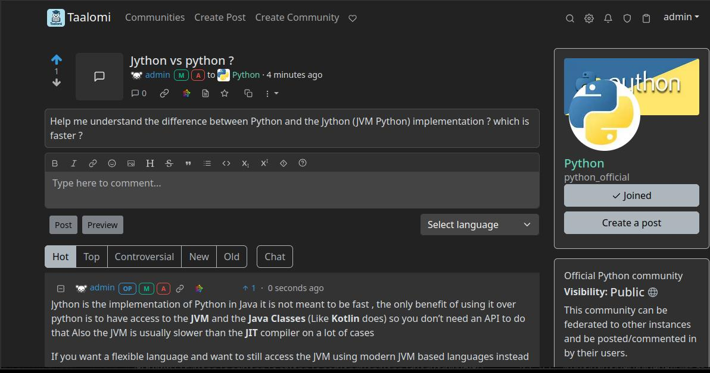
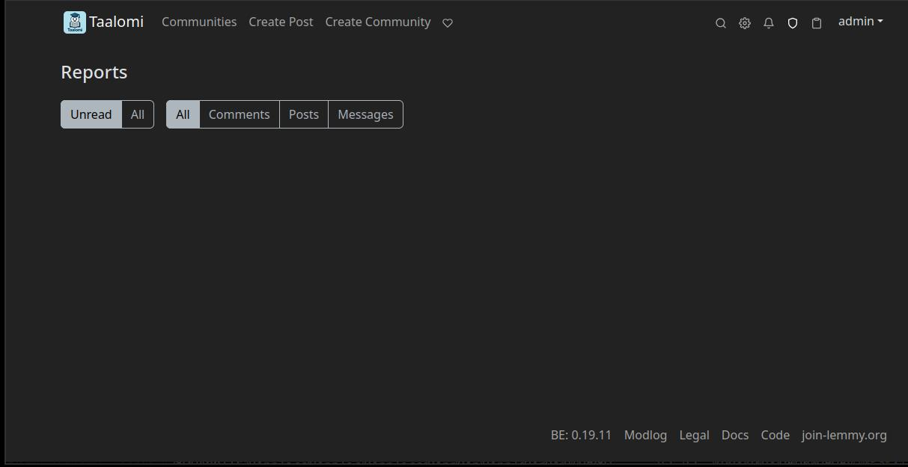