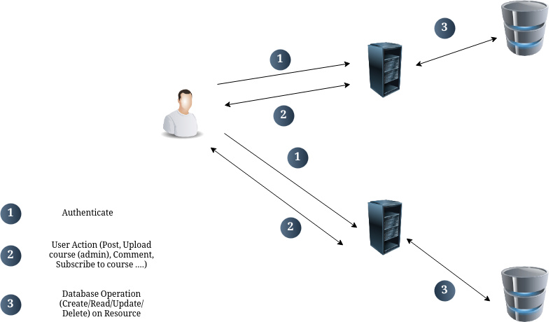

# 6 - Experimentation

## 6.1 - Prototype

After having explored the personalization and functionality requirements of an educational social platform, this chapter aims to present and discuss the prototype implementation of the system: Taalomi.

The Taalomi system is a modular and community-driven educational platform that combines features of social networking (via Lemmy), content management (via WordPress), and course delivery (via LearnPress). The system has been architected to allow three main roles Admin, Teacher, and Student to interact seamlessly within a centralized community environment.

## 6.2 - Architecture Type

The system follows a modular client-server architecture, where the backend services are RESTful and decoupled from the front-end interfaces. The platform combines microservices and plugin-based customization through existing open-source platforms (Lemmy and WordPress). The following graph demonstrates it :

